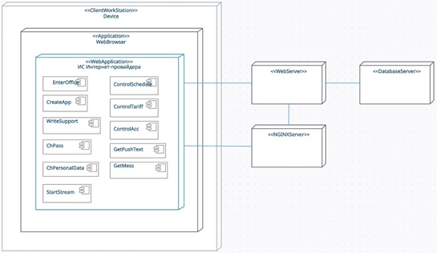
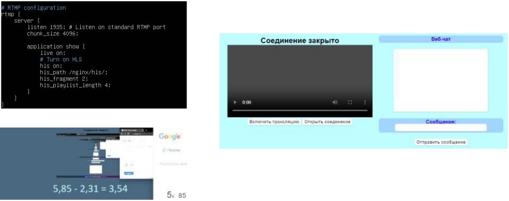

# Информационная система для интернет-провайдера

React + Golang + MySQL

<h1>Главная страница</h1>

  

Требования к системе

1. Общие сведения

Данная ИС создана для интернет-провайдеров, чтобы автоматизировать некоторые бизнес-процессы. С её помощью можно выводить актуальную информацию о тарифных планах, заключать договор с клиентом, у каждого клиента есть личный кабинет, клиент может оставить отзыв или обратиться в поддержку. Так же по имеющимся данным в БД можно делать некоторые отчёты.

2. Назначение и цели создания (развития) системы

Данный продукт создаётся для автоматизации бизнес-процессов в компании интернет-провайдера. Для более лучшей коммуникации с клиентом, сбора данных, на основе которых можно будет корректировать некоторые бизнес-решения. Так же можно создать модуль оптимизации маршрутов для установщиков оборудования, тем самым ускорив процесс доставки и уменьшив затраты на поездки. А на основе данных об использовании тарифов, можно создавать новые или изменять имеющиеся, чтобы увеличить прибыль компании.

 

BPMN-диаграмма процесса создания заявки и договора

  

 

BPMN-диаграмма процесса обращения в поддержку для смены IP-адреса

  

 

Функциональные требования:

1. Авторизация и регистрация пользователя. Использование cookies-сессий или JWT.

2. Возможность проведения видео-трансляций. Необходимо использовать Nginx сервер, который будет обрабатывать входящие RTMP сигналы, конвертировать в HLS и DASH, рассылать видео в плеер.

3. Возможность создавать учётные записи с различными правами доступа к функционалу веб-приложения.

4. Иметь возможность редакировать данные клиентов. Нужно использовать REST API.

5. Веб-чат на трансляции. Для его реализации использовать WebSocket. Чат должен иметь возможность сохранять историю сообщений и показывать новым пользователям последние 10 сообщений.

 

Нефункциональные требования:

1. Адаптивный дизайн веб-приложения.

2. Плеер для трансляции, который будет работать на различных устройствах.

3. Задержка на трансляции от 1 до 3 секунд.

Имеются 3 роли, под которыми пользователь может зайти в ИС и выполнить некоторые действия.

 

1.	Клиент.

  a.	Создать заявку на подключение.

  b.	Войти в личный кабинет.

  c.	Обратиться в поддержку.

  d.	Сменить пароль.

  e.	Получать push-уведомления.

  f.	Изменить личные данные.

 

2.	Сотрудник поддержки.

  a.	Получать обращения и отвечать на них.

  b.	Доступ к прямым трансляциям.

  c.	Управление расписанием.

  d.	Получать push-уведомления.

 

3.	Системный администратор.

  a.	Управление тарифами.

  b.	Управление правами доступа.

  c.	Доступ к прямым трансляциям.

  d.	Управление расписанием трансляций.

  e.	Получать push-уведомления.

 

UML диаграмма классов 

  

 

UML диаграмма развертывания 

  

 

Физическая модель БД 

  

 

Логическая модель БД 

  

Настройки rtmp модуля

  

